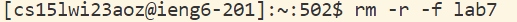
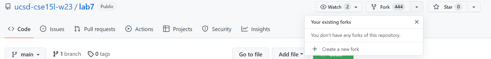
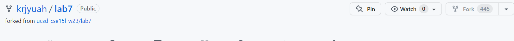
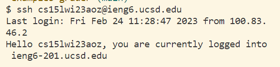
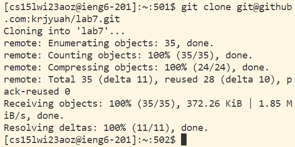
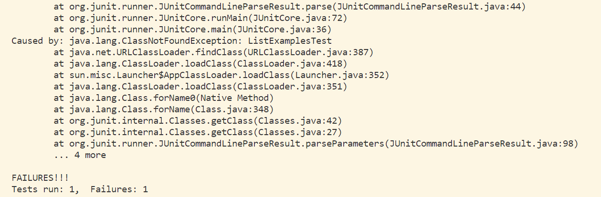
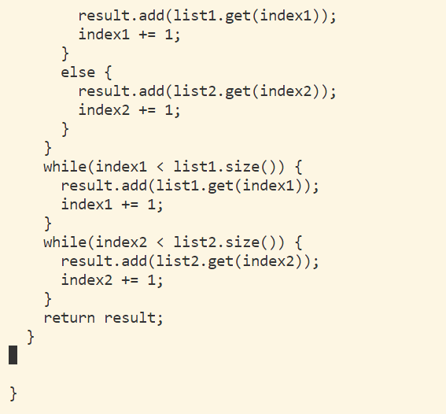
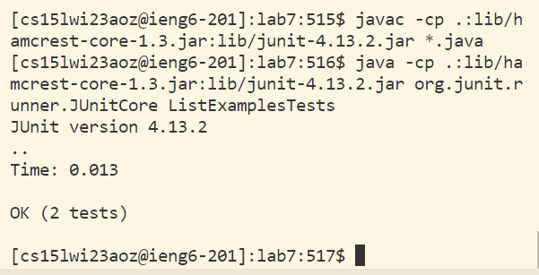

# Reproduce the Task From the Competition

1. **Setup** Delete any existing forks of the repository you have on your account

2. **Setup** Fork the repository

3. **The real deal** Start the timer!

4. Log into ieng6

5. Clone your fork of the repository from your github account

click git clone, then **ctrl-c** from github, back to vistual studio, **ctrl-v** to the command line
then **enter**

6. Run the tests, demonstrating they they fail

type in the Junit test code so I cd into lab7, ctrl-v from the week 3 meterial **crtl-c**, and **ctrl-v** the test code for the windows systems to the command line

7. Edit the code file to fix the failing test

type nano ListExamples.java get into the nano system, and **down to find the error lines, which is the last while loop,
it is index2 +=1 and not index1 +=1. After change it, type in **ctrl-o** to save the files,, **enter**, **ctrl-x** to exit the sysytem

8.Run the tests, demonstrating that they now succeed

**Up** **Up** **Up** **Up** **Up** **Up** **Up** **Enter** to find the Junit javac test code, then **Up** **Up** **Up** **Up** **Up** **Up** **Up** **Enter** to find the Junit java test code

9. Commit and push kthe resulting change to your Github account(you can pick any cimmit message!)

First type in git add List **tab** (which will fill out the compelete word automatic).java, **enter**, then git commit -m "Updated", **enter** , then git push, **enter** to push the save file to github page
